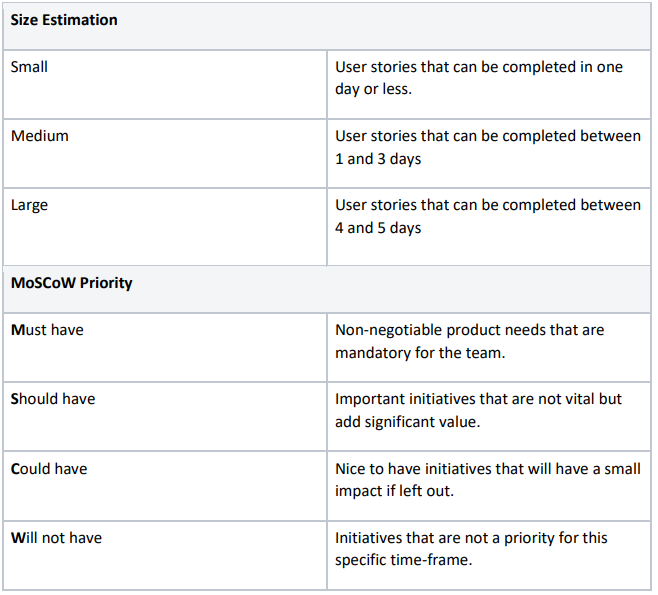
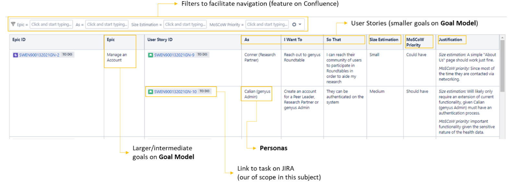

# Week 6 Workshop - User Stories

In this workshop, you will practice writing user stories.

## Discussion
1. Why we write user stories?
2. What are user stories used for?

## Work on Your Project

<b>“As [persona], I want to [goal], so that [benefit].” </b>

Tasks to be performed:
1. Consider the goal model and personas you created to your project. Each team member should pick one user story to write during this workshop (following the template you learned in the lecture). Working together as a team, decide together on different user stories to be written by each of you;
2. Write your user stories;
3. Add an estimation and justification for that to your user stories;
4. Prioritize your user stories. Use the MoSCoW technique to classify/prioritize your user stories on Confluence. Reference:
https://www.agilebusiness.org/page/ProjectFramework_10_MoSCoWPrioritisation
5. Share your user stories with your team (Zoom chat for those online);
6. Review one different user story from a different team member. Each student should review at least one user story from each member;
7. Provide feedback to the reviewed user stories;
8. Review/rework your own user stories after receiving feedback from other team members;
9. Upload the final improved version of your user story to Confluence (shared page on Confluence to document all the user stories. PLEASE aim for quality. Create an organized page and document your user stories in the best possible way.

## Examples:

- Confluence Space (2019)
https://confluence.cis.unimelb.edu.au:8443/display/ESPS/User+Stories

- User Stories Classification 
    
    

- An example of organising user stories on Confluence:
