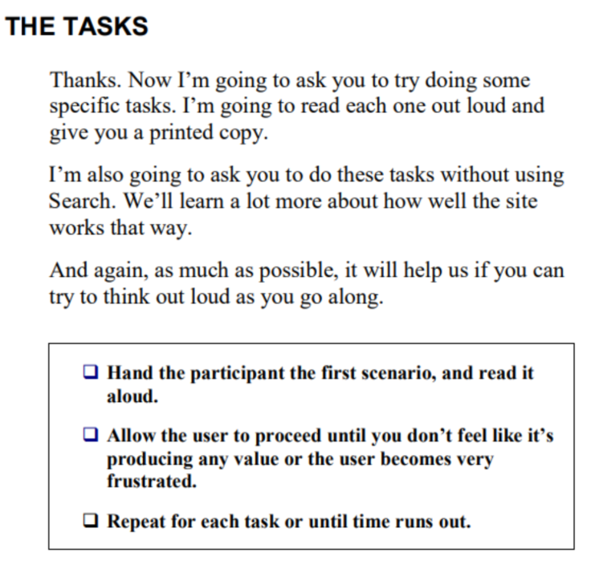

# Week 7 Workshop - Low Fidelity Prototype

In this workshop, you will discuss about what low fidelity prototypes are and how they are constructed. Then, you will create low fidelity prototypes for your project.

## Work on Your Project
*“Elaborate usability tests are a waste of resources. The best results come from testing no more than 5 users and running as
many small tests as you can afford” [1]*

Tasks to be performed:
1. Consider the goal model and personas you created to your project. What user stories (**do** list – leaves on your goal model) would you like to prototype and test/validate with your client during your next meeting? **Working together as a team, decide on one (or two) different user story to be prototyped by all of you (together)** (update your decisions on Trello to keep track of your progress);
2. Prototype the main user stories (high priority) of your product first. Make sure you’ll be able to soon test/validate them with your client and with real users;
3. From now on, everyone should use the same prototyping tools – consistency is key. In this phase of the subject we will use Figma and/or MarvelApp tools. Create **low fidelity** prototypes (mockups) to the user story you chose to work on;
4. Make sure you create navigational links between your prototype screens;
5. Once you finish creating your low fidelify (mockup) prototype, start working on appropriate tasks to test it. Create tasks that will be presented to real users to test your unique user story through your prototype;
6. Document the tasks you’ll test with your industry partner and real users. Use Steve Krug’s Usability Test Script [http://sensible.com/downloads/test-script-web.pdf] as a guideline.

Example:                                                                                    

**Here you’ll work on the scenario that you’ll read aloud to real users.**                                                           

To help you writing tasks, I strongly recommend you watch this short video: https://www.youtube.com/watch?v=dkKS6aKEC6M

7. Before testing your tasks with real users, make sure YOU test your tasks against your prototype. Can you improve the tasks description? Can you improve your prototype?
8. After reviewing your tasks, export the low prototype as a clickable-PDF and upload the document together with the task description to Confluence. Each team member should provide at least one feedback to the prototype (on Confluence comments) and task descriptions uploaded to Confluence. Once feedback is provided, rework your prototype (again) and update it on Confluence. Improve your prototypes before testing them with real users.
9. **Once you finish this very first low fidelity prototype for one of your user stories, you’re more than welcome to start prototyping the remaining user stories of your project as we will need to prototype most of product for high-fidelity digital prototype.**

[1] Nielsen, Jakob, and Landauer, Thomas K.: "A mathematical model of the finding of usability problems," Proceedings of ACM INTERCHI'93 Conference (Amsterdam, The Netherlands, 24-29 April 1993), pp. 206-213.