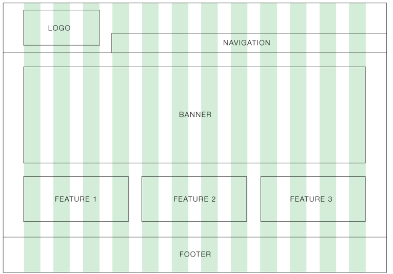
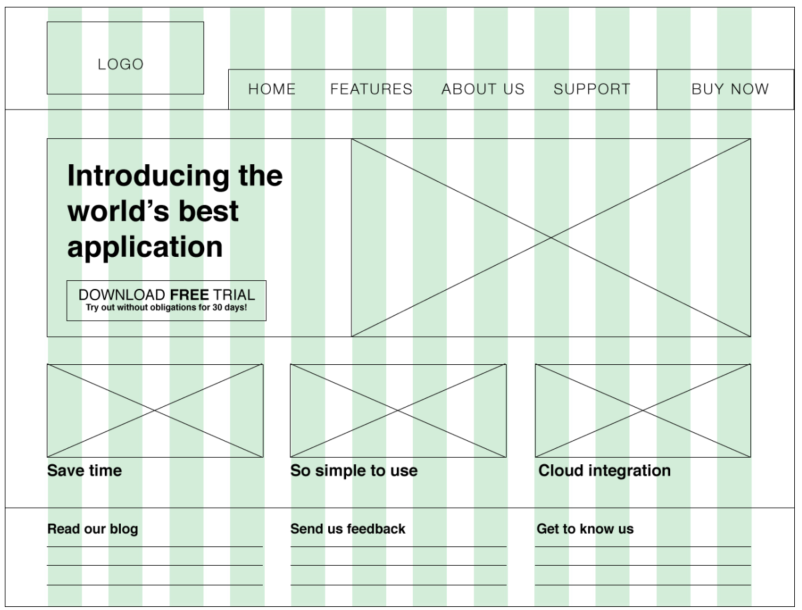
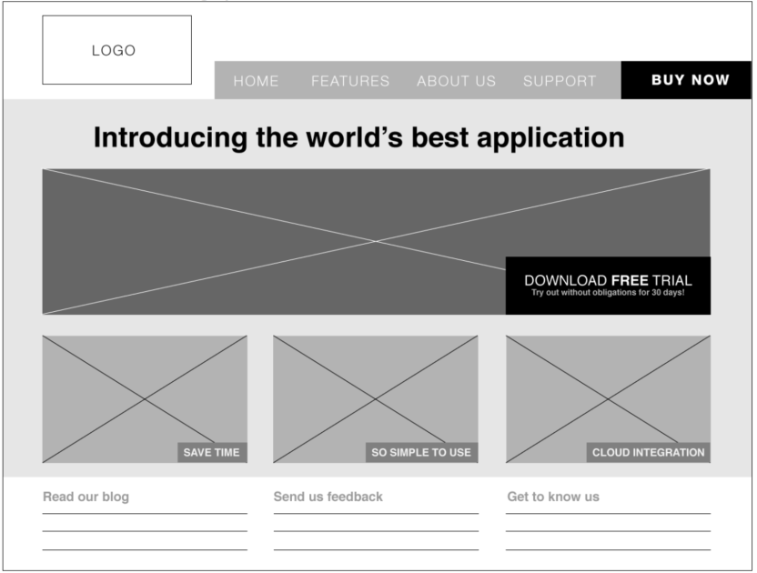

# Week 9 Workshop - Moodboard, Wireframe and High Fidelity Prototype

In this workshop, you will discuss about what high fidelity digital prototypes are and how they are constructed. Then, you will start creating a mood board, wireframes and a high fidelity digital prototype for your project.

## Discussion
1. Why we design high fidelity digital prototypes?
2. What is a mood board and how it can help you in this journey?
3. Why should we wireframe our system before jumping to the digital prototype straight away?

## Work on Your Project
*“Elaborate usability tests are a waste of resources. The best results come from testing no more than 5 users and running as
many small tests as you can afford” [1]*

Tasks to be performed:
1. Download the mood board template available on Canvas;
2. Divide your group into two sub-groups (2-2 in case of 4 members, 3-2 in case of 5 members and keep the group intact if there are only 3 members);
3. Construct a mood board. Both sub-groups, without discussing with each other, should construct a mood board for their projects **[25 minutes working in this task]**. Your mood board should include visual references (photos, illustrations, icons), typefaces (1-3) and colour palette. This article can help you with this task: https://www.creativebloq.com/inspiration/get-most-out-moodboards-91516630. The goal is to set the mood of the system. Be abstract.
4. Present your mood board at the end of 25 minutes. Vote for the best one (or combine them into one) **[5 - 10 minutes]**;
5. Wireframe your system [https://webdesign.tutsplus.com/articles/a-beginners-guide-towireframing--webdesign-7399];

6. Draw the boxes of your system (grid-based). Different team members can work on different boxes (or screens); 

7. Use typography to define the information architecture of the boxes/screens; 

8. Tune the wireframe with greyscale; 

9. Move these boxes (and new ones) to Axure [https://www.axure.com/edu] (or to Figma) and start adding visual identity to the high-fidelity prototype. Your high-fidelity digital prototype must be well elaborated and as close to the final version of the system as possible. Spend some time working on it and make sure you carefully review everything (navigation, screens, alternative flows and so on) before your next deliverable and final presentation.

I’m fully aware this is a long workshop. I do not expect you to finish all the activities during the tutorial time. I kept this way so you can you this document as a guideline for your next tasks in the subject (creating your digital prototype and getting ready to Sprint 4). Have fun!

[1] Nielsen, Jakob, and Landauer, Thomas K.: "A mathematical model of the finding of usability problems," Proceedings of ACM INTERCHI'93 Conference (Amsterdam, The Netherlands, 24-29 April 1993), pp. 206-213.
